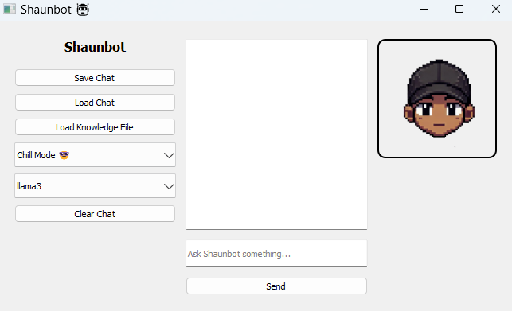

# 🤖 Shaunbot

A local AI chatbot powered by **LLaMA 3** (via **Ollama**) with a sleek, personalized **PyQt5** interface.  
Built to run **100% offline** with fast, threaded replies, character personas, and a polished UI experience.

---

## 🚀 Features

✅ Chat with LLaMA 3 locally — no API key needed  
✅ Character selector with multiple Shaunbot modes  
✅ Local knowledge file loading for smarter context  
✅ Save & load chat history (JSON-based)  
✅ Typing animation for realistic replies  
✅ Clean, modern sidebar UI with icons  
✅ Fully threaded — no lag or freezing  
✅ Graceful error handling for empty bot replies  
✅ Clear Chat button to reset the convo  
✅ No internet required after model download  

---

## 🖼️ Screenshot



---

## 🛠️ How to Run

1. **Clone the repo:**

```bash
git clone https://github.com/rinnemunch/shaunbot.git
cd shaunbot 
``` 

2. Create and activate a virtual environment: 
```bash 
python -m venv venv
source venv/bin/activate        # On Windows: .\venv\Scripts\activate
``` 

3. Install dependencies: 
```bash 
pip install -r requirements.txt
```

4. Make sure Ollama is installed and running:
```bash 
ollama run llama3
``` 
5. Launch Shaunbot:
```bash 
python main.py
```

## 📦 Requirements 
- Python 3.x
- PyQt5
- requests
- Ollama (for running LLaMA 3 locally) 

## 💡 Notes 
- All replies are generated locally — no internet needed after the model is downloaded
- Uses QThread to keep UI smooth and responsive
- Typing animation is handled by QTimer and can be tweaked in the code
- Knowledge file loads up to 3000 characters to stay prompt-safe 

# 🔓 License 
MIT — use it, remix it, break it, improve it.
