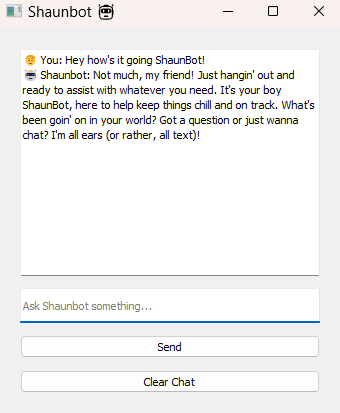

# 🤖 Shaunbot

A local AI chatbot powered by LLaMA 3 (via Ollama) with a smooth PyQt interface.  
Built to run entirely offline with fast, threaded responses and a natural conversation flow.

---

## 🚀 Features

✅ Chat with LLaMA 3 locally — no API key needed  
✅ Conversation memory (context-aware replies)  
✅ Smooth UI built with PyQt5  
✅ Typing animation for realistic replies  
✅ Clear Chat button to reset the convo  
✅ Fully threaded — no lag or freezing  

---

## 🖼️ Screenshot



---

## 🛠️ How to Run

1. Clone the repo:
```bash
git clone https://github.com/rinnemunch/shaunbot.git
cd shaunbot
````
2. Create and activate a virtual environment: 
```bash
python -m venv venv
source venv/bin/activate        
# Windows: .\venv\Scripts\activate
```` 

3. Install dependencies: 
```bash
pip install -r requirements.txt
````  

4. Make sure Ollama is installed and running: 
```bash
ollama run llama3
```` 

5. Launch Shaunbot: 
```bash
python main.py
```` 

📦 Requirements 
- PyQt5

- requests

- Ollama (for running LLaMA 3 locally) 

💡 Notes 
- All replies are generated locally — you don’t need an internet connection after the model is downloaded

- Uses QThread to avoid UI blocking

- Typing animation is customizable (via QTimer) 

🔓 License 
MIT — use it, remix it, break it, improve it.